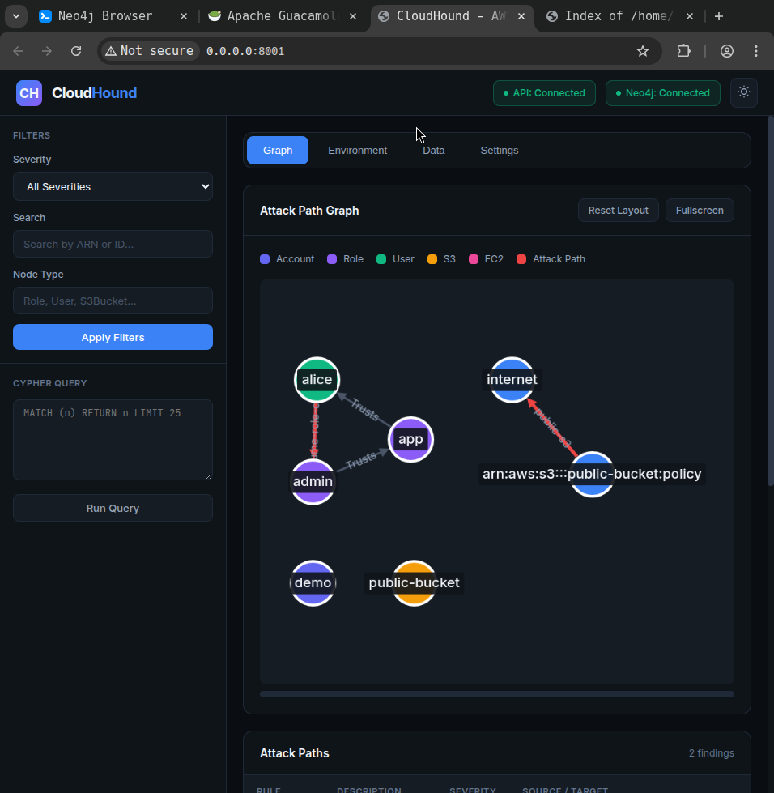
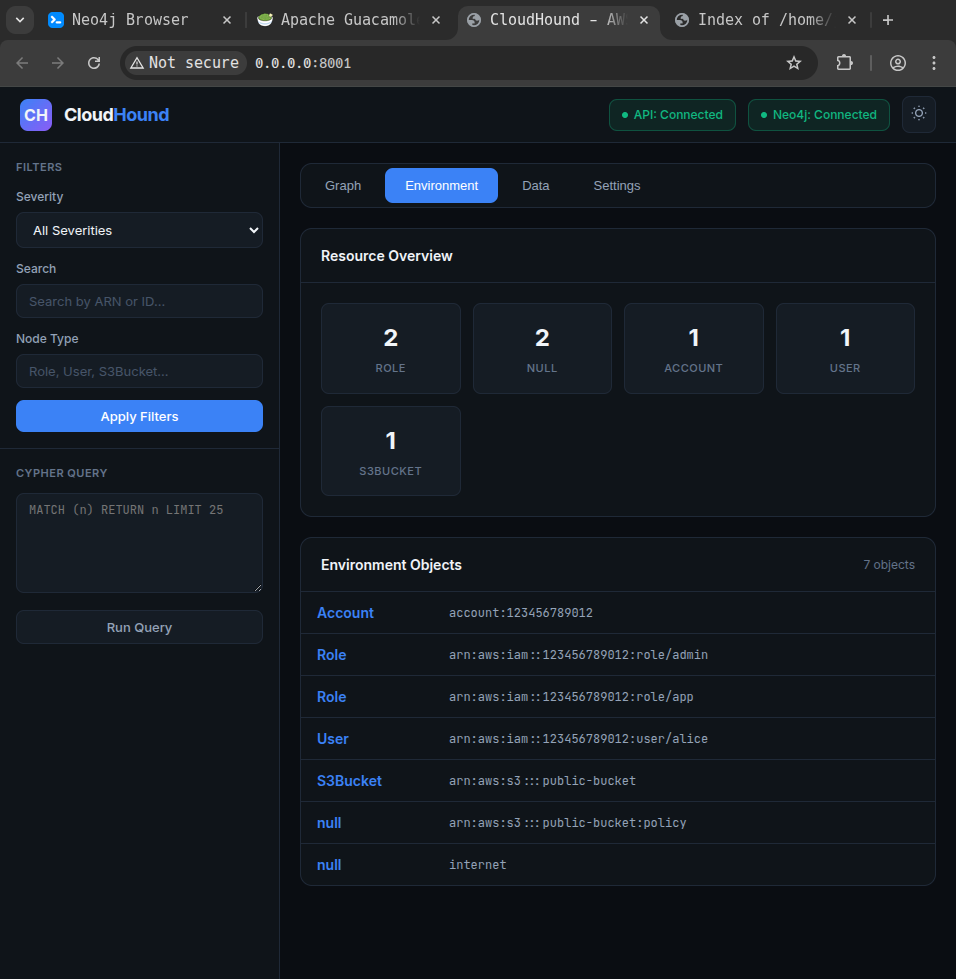
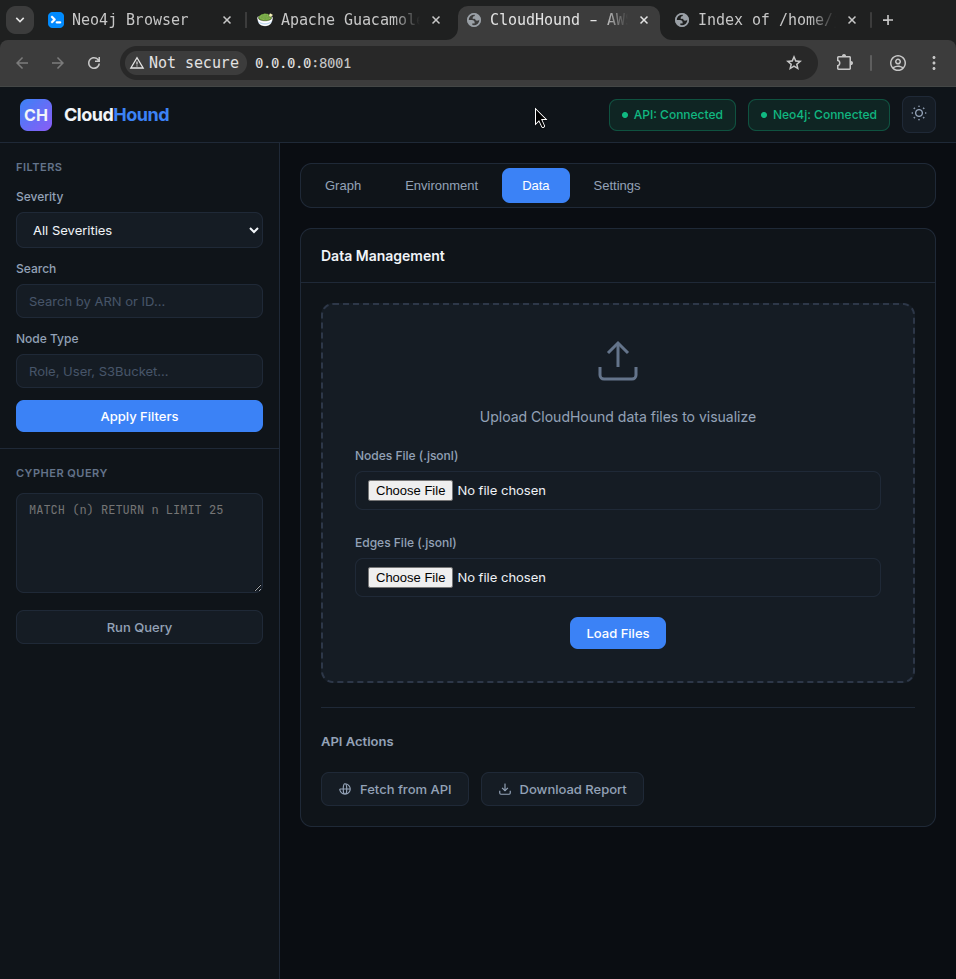
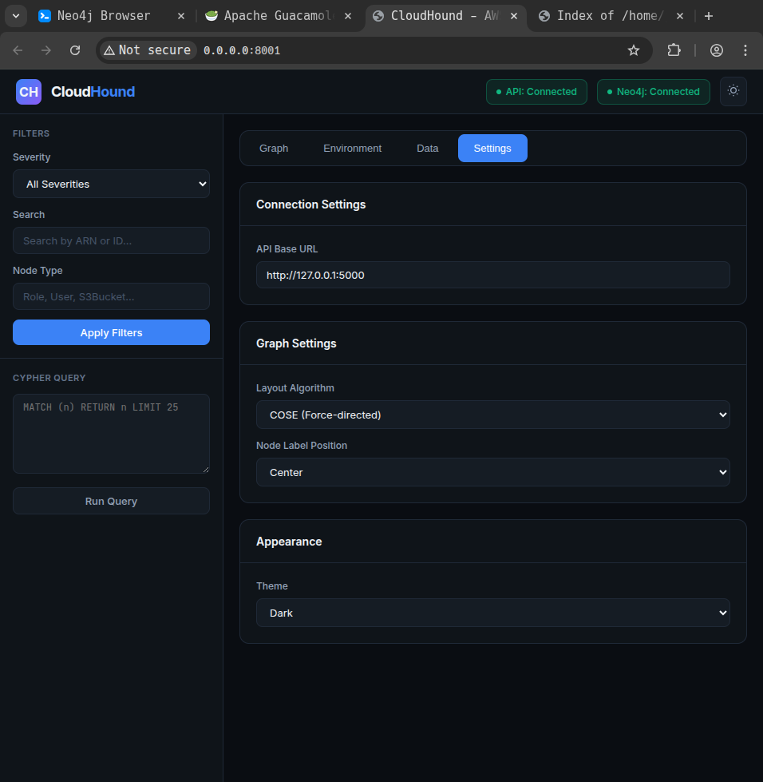

# CloudHound

BloodHound-style graph analytics for multi-cloud environments. Collect, normalize, and visualize cloud resources, trust relationships, and attack paths.



## Features

- **Multi-Cloud Support**: Modular architecture for AWS (with GCP and Azure coming soon)
- **AWS Data Collection**: Enumerate IAM, S3, EC2, Lambda, EKS, RDS, and 30+ other AWS services
- **Graph Visualization**: Interactive graph showing trust relationships, permissions, and attack paths
- **Attack Path Analysis**: Automated detection of privilege escalation and lateral movement opportunities
- **Multiple Export Formats**: JSON, SARIF (for CI/CD integration), and standalone HTML reports
- **Neo4j Integration**: Store and query data using Cypher
- **API Authentication**: JWT and API key support for secure access
- **Offline Support**: Export bundles for air-gapped analysis

## Screenshots

### Graph View
Visualize organizational structure, trust relationships, and attack paths with severity-colored edges.


### Environment Summary
View object counts and details by type (Accounts, Roles, Users, S3 Buckets, etc.).



### Data Management
Import/export data, fetch from API, or load files directly for offline analysis.



### Attack Paths
View detected security findings with severity levels, rules, and affected resources.


### Settings
Configure API connection, graph layout algorithm, and appearance options.



## Installation

```bash
# Clone the repository
git clone https://github.com/jeremylaratro/cloudhound.git
cd cloudhound

# Install with pip
pip install -e .

# Or install with optional dependencies
pip install -e ".[dev]"      # Development tools
pip install -e ".[gcp]"      # GCP support (coming soon)
pip install -e ".[azure]"    # Azure support (coming soon)

# (Optional) Start Neo4j
docker run -d --name neo4j \
  -p 7474:7474 -p 7687:7687 \
  -e NEO4J_AUTH=neo4j/letmein123 \
  neo4j:latest
```

## Usage

### Collect AWS Data

```bash
# Using default AWS profile
cloudhound collect --provider aws --output ./output

# Using specific profile and region
cloudhound collect --provider aws --profile myprofile --region us-east-1 --output ./output

# Collect specific services only
cloudhound collect --provider aws --services iam s3 ec2 lambda
```

### Normalize Data

```bash
# Generate nodes and edges from collected data
cloudhound normalize --input ./output
```

### Analyze for Attack Paths

```bash
# Run security rules
cloudhound analyze --input ./output

# Filter by severity
cloudhound analyze --input ./output --severity high
```

### Export Reports

```bash
# Export to JSON
cloudhound export --input ./output --format json --output report.json

# Export to SARIF (for GitHub/Azure DevOps)
cloudhound export --input ./output --format sarif --output findings.sarif

# Export to standalone HTML report
cloudhound export --input ./output --format html --output report.html
```

### Import to Neo4j

```bash
cloudhound import --input ./output --neo4j-uri bolt://localhost:7687 --neo4j-user neo4j --neo4j-password letmein123
```

### Start the API Server

```bash
# Start with authentication enabled
cloudhound serve --port 5000

# Start without authentication (development only)
cloudhound serve --port 5000 --no-auth

# Generate an API key
cloudhound keygen
```

### Start the UI

```bash
# Start the UI (in another terminal)
cd ui && python -m http.server 8001
```

Open http://localhost:8001 in your browser.

## Supported Services

| Category | Services |
|----------|----------|
| Identity | IAM (users, roles, policies), STS, SSO |
| Compute | EC2, Lambda, EKS, ECR |
| Storage | S3, RDS |
| Security | CloudTrail, GuardDuty, SecurityHub, Detective, WAF, Shield |
| Networking | VPC |
| Management | Organizations, CloudFormation, Config |
| Messaging | SNS, SQS |
| Secrets | Secrets Manager, SSM Parameters, KMS |
| CI/CD | CodeBuild, CodePipeline |
| Monitoring | CloudWatch |

## Attack Path Rules

CloudHound automatically detects potential attack paths including:

- **Privilege Escalation**: Users/roles that can escalate to admin
- **Cross-Account Access**: Trust relationships allowing lateral movement
- **Public Exposure**: S3 buckets, security groups with public access
- **Credential Access**: Roles with access to secrets or KMS keys

## Architecture

```
cloudhound/
├── core/
│   ├── graph.py       # Core data structures (Node, Edge, AttackPath)
│   ├── registry.py    # Plugin registries for collectors/normalizers/rules
│   └── base.py        # Base classes and utilities
├── collectors/
│   ├── aws/           # AWS service collectors (IAM, S3, EC2, etc.)
│   ├── gcp/           # GCP collectors (coming soon)
│   └── azure/         # Azure collectors (coming soon)
├── normalizers/
│   └── aws/           # AWS data normalizers
├── rules/
│   └── aws/           # AWS security rules (IAM, S3, EC2, etc.)
├── exporters/
│   ├── json_export.py # JSON report format
│   ├── sarif.py       # SARIF format for CI/CD
│   └── html.py        # Standalone HTML reports
├── api/
│   ├── server.py      # Flask REST API
│   └── auth.py        # JWT/API key authentication
└── cli/
    └── main.py        # Unified CLI interface

awshound/                # Legacy AWS-specific module
├── auth.py            # AWS authentication handling
├── collector.py       # Service data collection
├── normalize.py       # Convert raw data to graph nodes/edges
└── rules.py           # Attack path detection rules

ui/
└── index.html         # Web-based graph viewer
```

## Requirements

- Python 3.10+
- AWS credentials with read permissions
- Neo4j 4.x+ (optional, for persistence)

## License

This software is licensed for **non-commercial use only**. See [LICENSE](LICENSE) for details.

For commercial licensing inquiries, please contact the author.
